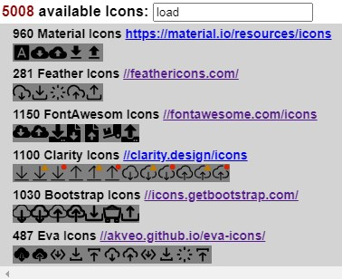

# W3C Custom Element: &lt;svg-icon>

**No** external SVG files, **No** dependencies

# See https://iconmeister.github.io

````
<svg-icon is=settings stroke=red rotate=45 ></svg-icon>
````



# See https://iconmeister.github.io