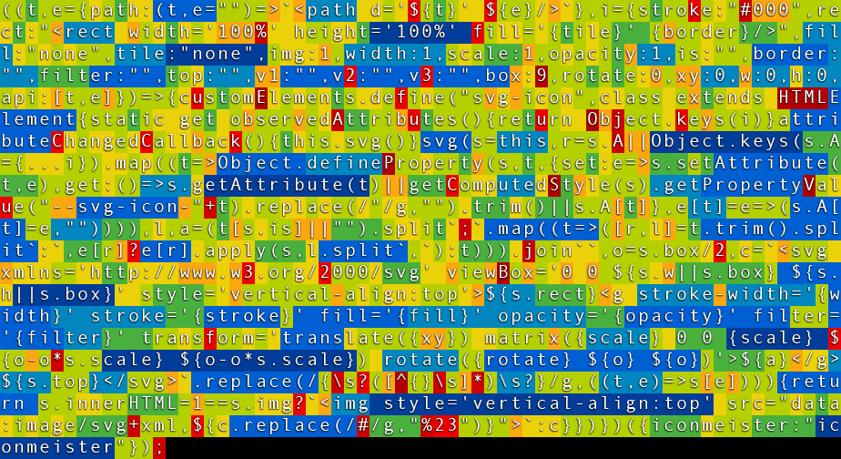

# W3C Custom Element: &lt;svg-icon>

**No** external SVG files, **No** dependencies

# For all documentation see: https://iconmeister.github.io

````
<svg-icon is=settings stroke=red rotate=45 ></svg-icon>
````

## IconMeister &lt;svg-icon> configuration options:

* is - iconname*
* box - (square) viewBox size
* stroke - SVG stroke color
* width - SVG stroke-width
* fill - SVG fill color
* opacity - SVG opacity
* rotate - SVG transform rotate
* scale - SVG matrix scale
* tile - icon background color
* rect - (SVG notation) background SVG
* border - (SVG notation) border
* xy - SVG transform translate(x y)
* w & h - custom viewBox dimensions
* img - 1 (default) create IMG, 0 = create SVG
* v1,v2,v3 - custom variables
* filter - (SVG notation) filter

(*) No, IconMeister is **NOT** a _Customized Built-In Element_

## Build your own IconMeister on https://iconmeister.github.io


## IconMeister code is 796 Bytes gzipped (excluding icons)

